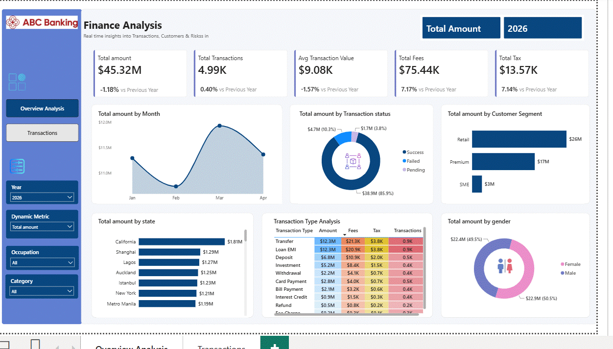
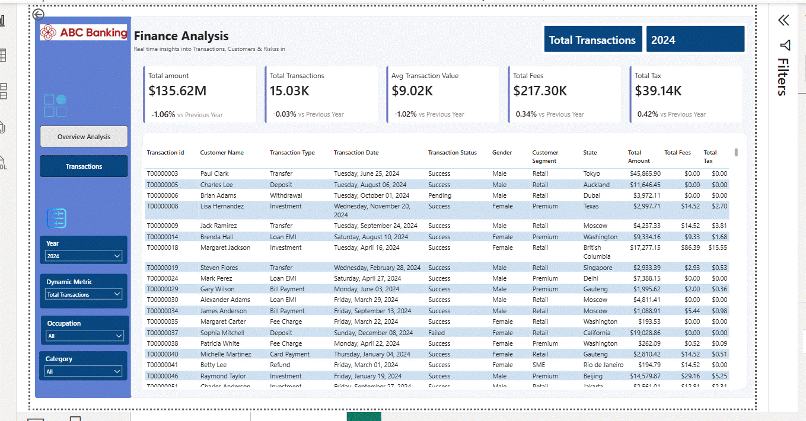
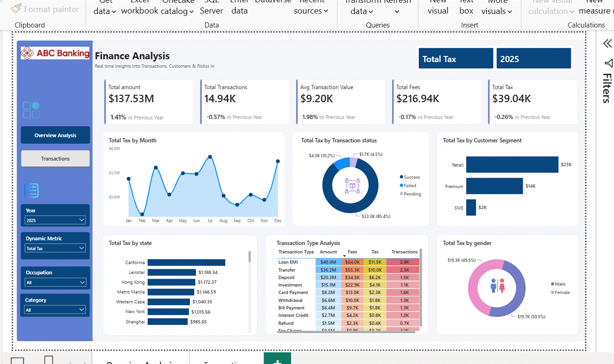

# Finance-Analysis
This is a power-bi dashboard to generate the finance analysis for dynamic metric in real time for ABC bank.

#  Finance Analytics Dashboard | Power BI

##  Project Overview

This project demonstrates the development of an interactive **Finance Analytics Dashboard** in **Power BI** using a synthetic financial transactions dataset. The dashboard provides insights into transaction performance, customer behavior, operational fees, taxes, and financial trends to support business decision-making.

The solution includes data cleaning, data modeling, DAX calculations, dynamic reporting, and interactive visualizations to help stakeholders monitor key business metrics and identify performance trends.

---

##  Business Objective

The objective of this dashboard is to provide management with a centralized reporting solution to:

* Monitor overall financial performance.
* Analyze transaction trends over time.
* Compare Year-over-Year (YoY) performance.
* Identify high-value customer segments.
* Evaluate regional financial performance.
* Monitor operational fees and tax collections.
* Analyze transaction success rates.
* Understand customer demographics.
* Support data-driven business decisions.

---

##  Dashboard Features

### Executive KPIs

* Total Transaction Amount
* Total Transactions
* Average Transaction Value
* Total Fees Collected
* Total Tax Collected
* Year-over-Year Growth
* YoY Percentage Growth

---

### Interactive Visualizations

* Monthly Transaction Trend
* Transaction Amount by Status
* Transaction Amount by Customer Segment
* State-wise Financial Performance
* Transaction Type Performance Matrix
* Gender-wise Transaction Analysis
* Dynamic KPI Selection
* Transaction Detail Report (Drill-through)

---

##  Dashboard Pages

### Dashboard 1 – Executive Summary

Provides a high-level overview of financial performance with interactive KPIs and visualizations.

(https://github.com/rajni-kapoor/Finance-Analysis/blob/main/Images_used/Screenshot_3.gif?raw=true)

---

### Dashboard 2 – Transaction Details

Displays transaction-level records with drill-through functionality for detailed analysis.

---

##  Tools & Technologies

* Power BI Desktop
* Power Query
* DAX (Data Analysis Expressions)
* Data Modeling
* Microsoft Excel

---

##  Data Preparation

The dataset was cleaned and transformed using Power Query.

### Data Quality Checks

* Removed duplicate records.
* Replaced missing fee values.
* Converted negative transaction amounts to positive values.
* Validated column quality and distribution.
* Standardized data types.

---

##  Data Model

A Star Schema was implemented consisting of:

### Fact Table

* Finance Transactions

### Dimension Tables

* Customer
* Calendar

A dedicated Calendar table was created to support Power BI Time Intelligence functions and Year-over-Year analysis.

---

##  DAX Measures

Key DAX measures include:

* Total Amount
* Total Transactions
* Average Transaction Value
* Total Fees
* Total Tax
* Previous Year (PY) Measures
* Year-over-Year (YoY) Growth
* YoY Percentage Growth
* Dynamic KPI Selection
* Dynamic Chart Titles

---

## 🎛 Interactive Features

Users can filter the dashboard by:

* Year
* Customer Category
* Occupation
* Dynamic KPI

---

##  Dashboard Preview

##  Key Skills Demonstrated

* Data Cleaning
* Data Transformation
* Power Query
* Data Modeling
* Star Schema Design
* DAX
* Time Intelligence
* KPI Development
* Interactive Dashboard Design
* Data Visualization
* Business Intelligence
* Financial Reporting
* Dashboard Optimization

---

##  Business Impact

The dashboard enables stakeholders to:

* Monitor financial performance in real time.
* Identify trends and anomalies quickly.
* Improve reporting efficiency.
* Track customer and regional performance.
* Support strategic planning through data-driven insights.
* Reduce manual reporting effort using interactive dashboards.

---

##  Future Enhancements

* Row-Level Security (RLS)
* Forecasting and Predictive Analytics
* Drill-through to Customer Profiles
* Mobile-Optimized Dashboard
* Automated Data Refresh
* Power BI Service Deployment

**Rajni Kapoor**

* LinkedIn: *(https://www.linkedin.com/in/rajni-kapoor-70a167263/)*
* GitHub: *https://github.com/rajni-kapoor*

If you found this project useful, feel free to ⭐ the repository.

